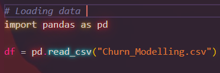

# Churn

Project Objective

The goal of this analysis is to understand which factors influence whether a customer will leave the bank (churn). This helps the business take actions to retain customers.

What is Churn.

Churn refers to a customer who stops using the company’s services.

Exited = 1 → the customer has left and Exited = 0 → the customer has stayed. Reading this data is an important business problem because retaining customers is cheaper than acquiring new ones.

Loading the Data

import pandas as pd

df = pd.read_csv("Churn_Modelling.csv")

Explanation:
Pandas is a library for data analysis read_csv() loads the dataset and df is a DataFrame (a table containing all the data)

Data Preparation

X = df[["Age", "Balance", "NumOfProducts"]]
y = df["Exited"]

Explanation:
X (features) - input data (customer characteristics)
y (target) - output (whether the customer leaves)

Selected features:

Age - customer age
Balance - account balance
NumOfProducts - number of products

Exploratory Data Analysis (EDA)

print(df["Exited"].value_counts())
print(df.groupby("Exited")["Age"].mean())
print(df.groupby("Exited")["Balance"].mean())
print(df.groupby("Exited")["NumOfProducts"].mean())

Results of churn:

7,963 customers stayed
2,037 customers left (~20%)

Their age:
Stayed: ~37 years
Left: ~45 years

Data shows that older customers are more likely to leave.

According to their balance:
Stayed: ~72,000
Left: ~91,000

Customers with higher balances are more likely to leave.

According to my oppinion this is a critical business issue because valuable customers are being lost.

Number of products:
Stayed: ~1.54
Left: ~1.47

Customers with fewer products are more likely to churn

Business insights:

Around 20% of customers churn, older customers are at higher risk, high-balance customers are also at risk. More engaged customers (with more products) tend to stay longer.

Next steps modeling approach

After the analysis, a Logistic Regression model can be used by selecting key features such as age, balance, and number of products. The data is could be split into training and testing sets, and the model could be trained to predict the probability of customer churn.

Train/Test Split - Regression model

from sklearn.model_selection import train_test_split

X_train, X_test, y_train, y_test = train_test_split(X, y, test_size=0.2)

Explanation:
80% of the data → training
20% → testing

Purpose:
Here we evaluate how well the model performs on unseen data.

Model Creation (Logistic Regression)
from sklearn.linear_model import LogisticRegression

model = LogisticRegression()
model.fit(X_train, y_train)

Explanation:
Logistic Regression is model used for binary classification
fit() trains the model the model learns relationships between features and churn.

Model predictions

predictions = model.predict(X_test)

Explanation:

The model predicts whether a customer will leave:

0 → will not leave
1 → will leave

Example output:

[0 0 0 0 0 0 0 0 0 0]

This could means that the model predicts that these customers will not churn. However, here we have important observation. The model tends to predict mostly 0 (no churn). This is likely because the dataset is imbalanced most customers do not leave.

Model Evaluation Insight

Although the model achieved around 78% accuracy, this can be misleading, because 80% of customers do not churn.
